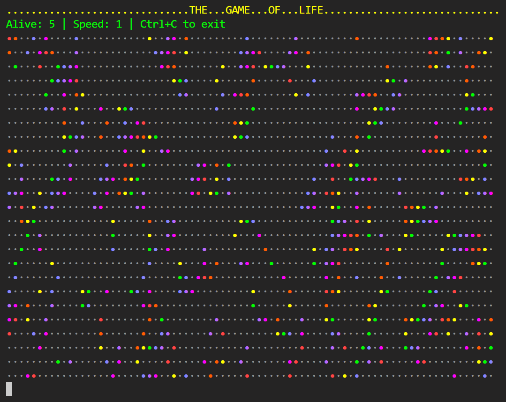

# Game of Life

A colorful terminal implementation of Conway's Game of Life with rainbow visualization.

## How It Works?
### Cells follow 3 rules:
- Survive with 2-3 neighbors
- Die from loneliness (<2) or overcrowding (>3)
- Reproduce if exactly 3 neighbors (dead cells come alive)
- Control: Adjust speed and starting patterns (fields/pattern)

## Features:
- Adjustable simulation speed 
- Two input modes:
    - Random grid generation with customizable density
    - Loading patterns from text files
- Toroidal world (edges wrap around)
- Generation counter and speed display
- ANSI escape codes for colors and terminal control

## For playing:
```bash
git clone https://github.com/yourusername/game-of-life.git
cd game-of-life
mkdir build && cd build
cmake ..
make
./life
```


